# 3psLCCA User Guide

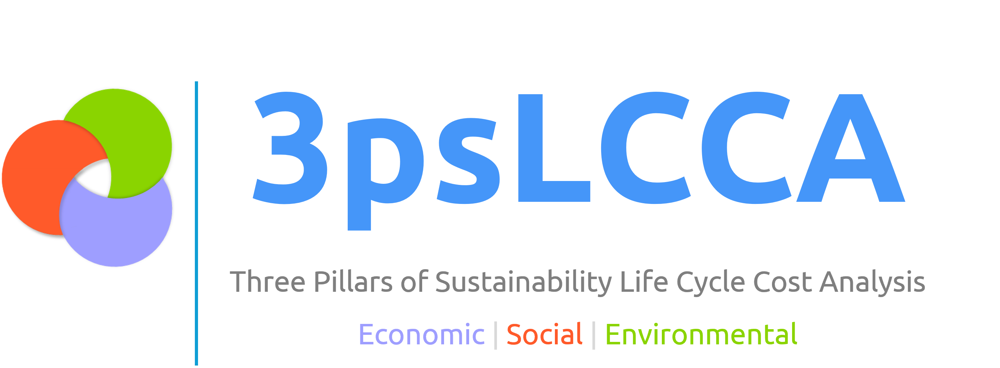

> **Version:** 2026.04.1 | **Developed at:** Osdag, FOSSEE, IIT Bombay | **Supported by:** ConstructSteel, Ministry of Steel, INSDAG

---

## Introduction

**3psLCCA** is a desktop application for **Life Cycle Cost Analysis (LCCA)** of bridge infrastructure projects, developed at IIT Bombay.

LCCA evaluates the total cost of a bridge across its entire service life — not just initial construction, but maintenance, repair, demolition, recycling, and associated environmental and social costs. All costs are brought to a common present-day value using discounting, allowing direct comparison of different design alternatives.

The analysis is structured around **three pillars of sustainability**:

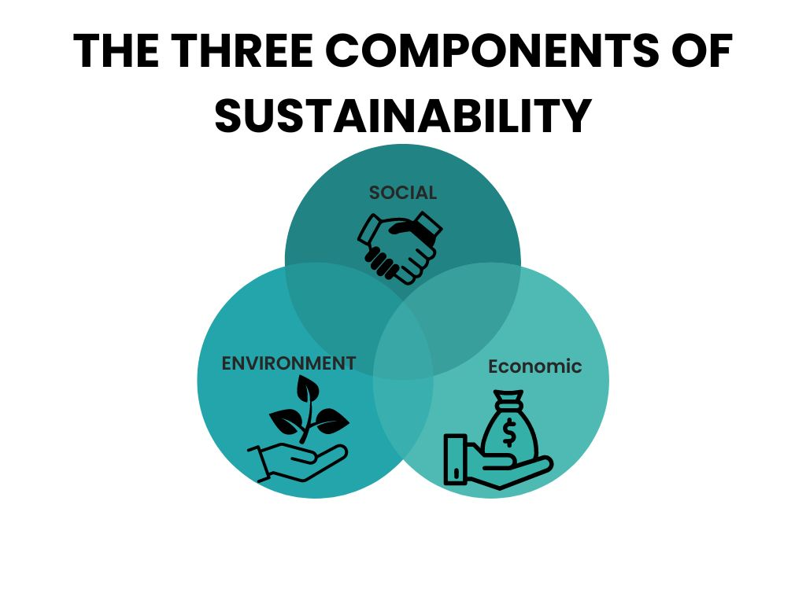

- **Economic** — direct monetary costs: construction, maintenance, demolition
- **Social** — road user costs: delays, accident costs, and detour expenses incurred during construction and maintenance activities
- **Environmental** — carbon emission costs across the bridge life cycle

This guide uses a single example project throughout: a **2-lane RCC T-Girder road bridge** over the Sone River on a state highway in Bihar. This is a straightforward, commonly built bridge type — suitable for demonstrating all features of the application without introducing complexity specific to long-span or special structures. All field values, quantities, and screenshots in this guide refer to this project.

**Coverage:**

1. Launching the application and the Home screen
2. Creating and opening projects
3. Comparing projects
4. General Information and Bridge Data input
5. Construction Work Data (Foundation, Sub Structure, Super Structure, Miscellaneous)
6. Financial, Traffic, Maintenance, Demolition, and Carbon Emission parameters
7. Running the analysis and interpreting results
8. Generating a PDF report

> Technical terms are defined inline at their first occurrence throughout this guide.

---

## Part A — Home Screen, New Project, Open, and Compare

### A.1 Launching the Application

Activate the conda environment and launch the application from the terminal:

```bash
conda activate 3psLCCA
threePSLCCA
```

A splash screen is displayed while the application loads its material databases and configuration.

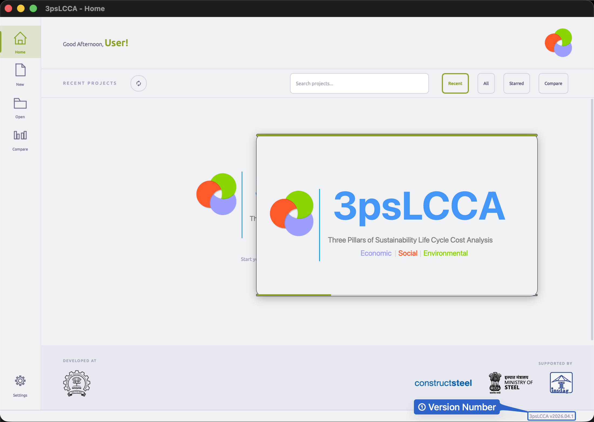

---

### A.2 The Home Screen

The Home Screen is the first screen you see after the app loads. It is divided into three structural areas: the **Left Sidebar**, the **Top Bar**, and the **Main Content Area**.

<!-- ============================================================
IMAGE PLACEHOLDER — A.2
File: documentation_images/partA/02_home_screen_annotated.png

HOW TO CAPTURE:
- Launch the app with at least one existing project visible
- Full window screenshot (include window titlebar)

HOW TO ANNOTATE:
- Use filled blue circles (⬤ #2563EB, white number inside) for all callouts
- ① Draw a tall rectangular blue box (#2563EB, 2px) enclosing the entire left sidebar strip
  Label outside the box to the right: "① Left Sidebar"
  Arrow: horizontal arrow from label pointing left into the sidebar box
- ② Draw a rectangular blue box along the top bar (from window title to right edge)
  Label above: "② Top Bar — project filter controls and search"
  Arrow: downward arrow from label into the bar
- ③ Draw a rectangular blue box around the entire main content area (project cards region)
  Label: "③ Main Content Area — project cards"
  Arrow: arrow pointing into the card grid
- Do NOT annotate individual buttons or text within — that is done in subsequent screenshots
============================================================ -->

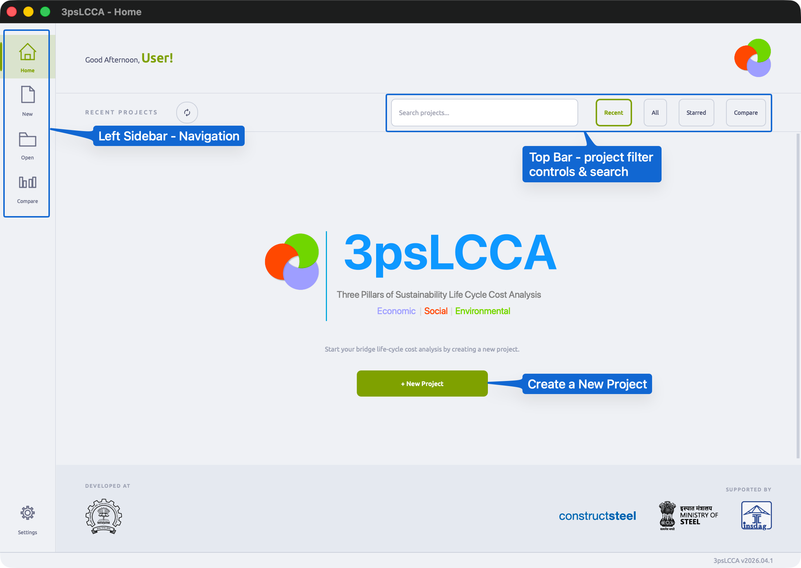

---

#### A.2.1 Left Sidebar

The left sidebar is fixed and visible on every screen in the application. It contains five navigation buttons, each leading to a distinct area.

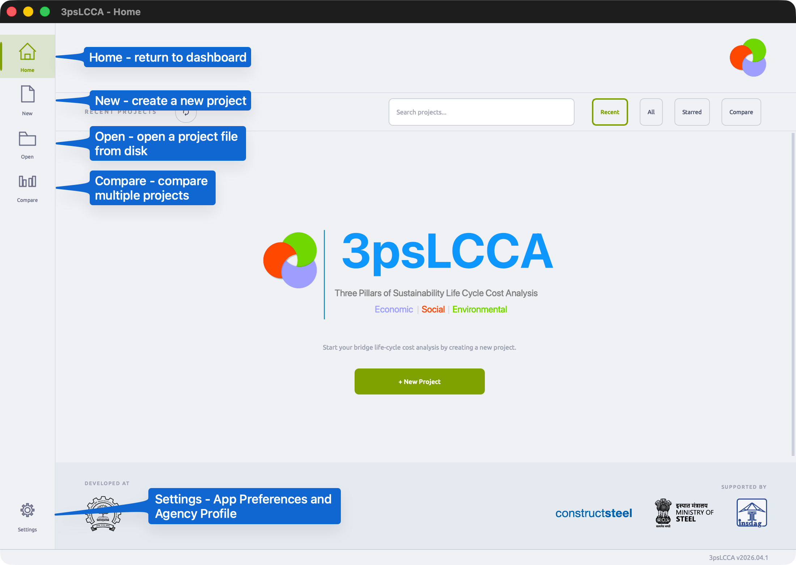

| Button | Action |
|--------|--------|
| **Home** | Returns to the project dashboard from anywhere in the app |
| **New** | Opens the New Project dialog |
| **Open** | Opens a file browser to load an existing `.3psLCCA` project file |
| **Compare** | Opens the project comparison view |
| **Settings** | Opens application preferences and agency profile management |

---

#### A.2.2 Top Bar and Project Views

The toolbar sits between the greeting area and the project grid. It contains a **dynamic section label**, a **refresh button**, a **search field**, and **four view filter buttons** — Recent, All, Starred, and Compare. The section label updates automatically to reflect the active view.

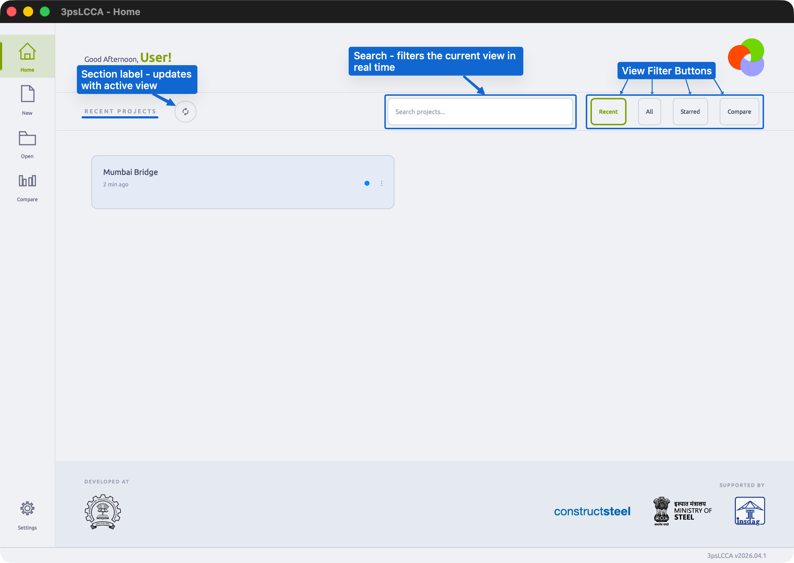

| Button | Section Label shown | What is listed |
|--------|---------------------|----------------|
| **Recent** | RECENT PROJECTS | All projects, sorted by last opened or last modified — most recent first |
| **All** | ALL PROJECTS — A-Z | All projects, sorted alphabetically by name |
| **Starred** | STARRED PROJECTS | Only projects you have starred (pinned). If none are starred, shows an empty state with instructions. |
| **Compare** | READY TO COMPARE | Only projects that have been fully calculated and locked. Enables multi-select mode for loading into the Compare view. |

The **search field** applies on top of whichever view is active — typing filters the current list in real time and changes the section label to `RESULTS FOR "..."`.

Each view is shown individually below.

##### Recent View

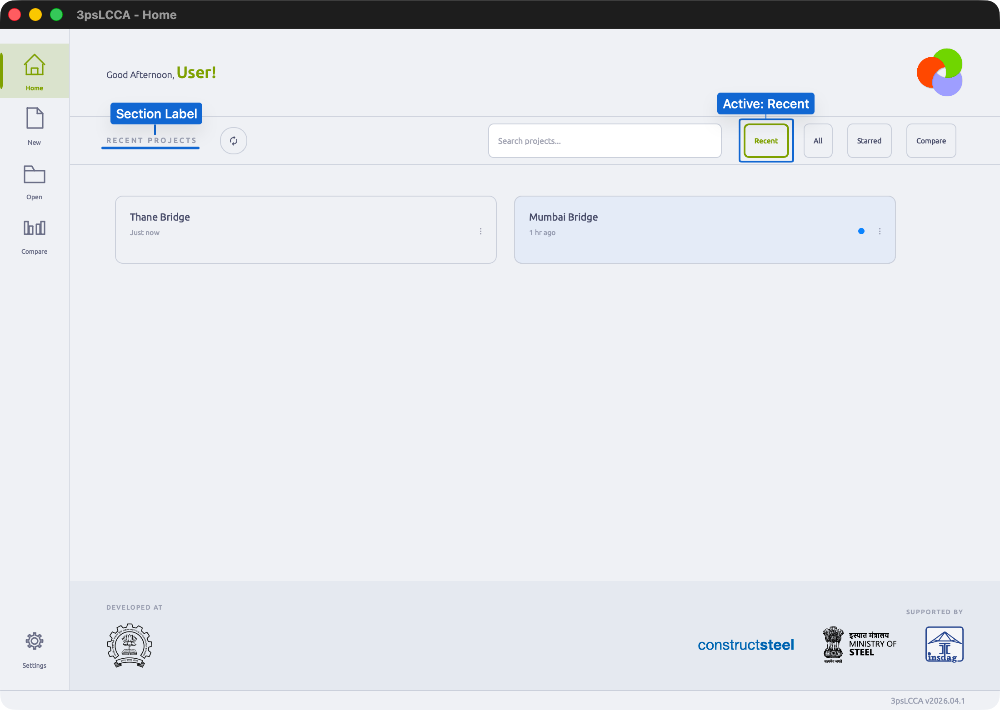

##### All View

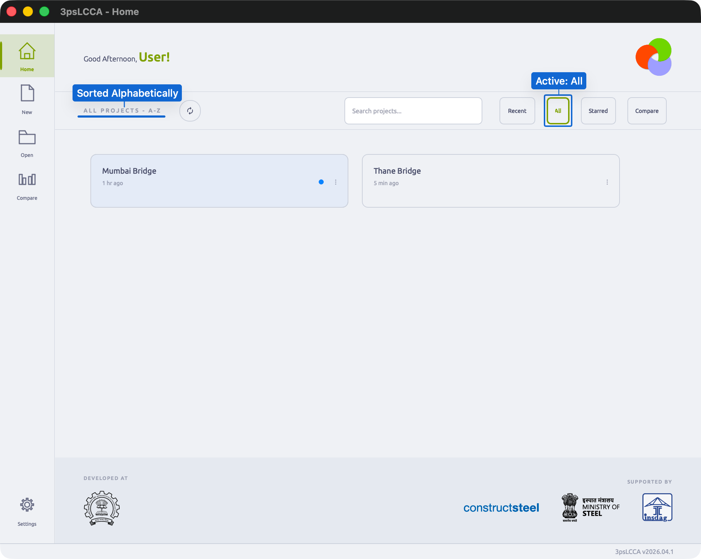

##### Starred View

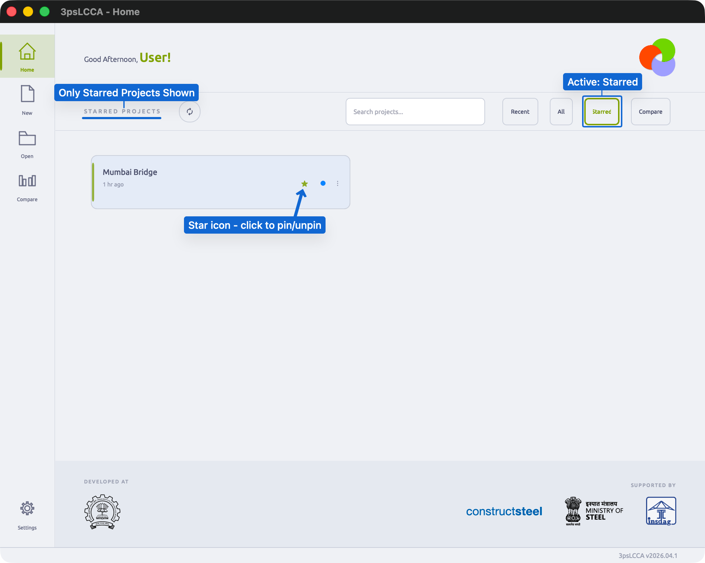

##### Compare View

<!-- Will do later -->
<!--  -->

> Projects appear in the Compare view only if they have been fully calculated and locked. A project that is still in progress will not appear here.

---

#### A.2.3 Project Cards

Each project in the list is shown as a card in the main content area.

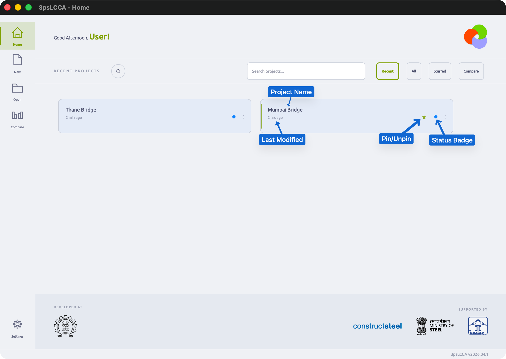

Each card shows:

- **Project name**
- **Last modified** — relative timestamp ("2 hours ago", "Yesterday")
- **Status badge**:

| Badge | Meaning |
|-------|---------|
| `OK` | Project is intact and ready to open |
| `Open` | Project is currently open in another window |
| `Needs Recovery` | Project was not closed cleanly; app will attempt recovery on open |
| `Corrupted` | Project file is unreadable and cannot be opened |

---

### A.3 Creating a New Project

Click **New** in the sidebar, or the **+ New Project** button on the Home Screen. The New Project dialog opens.

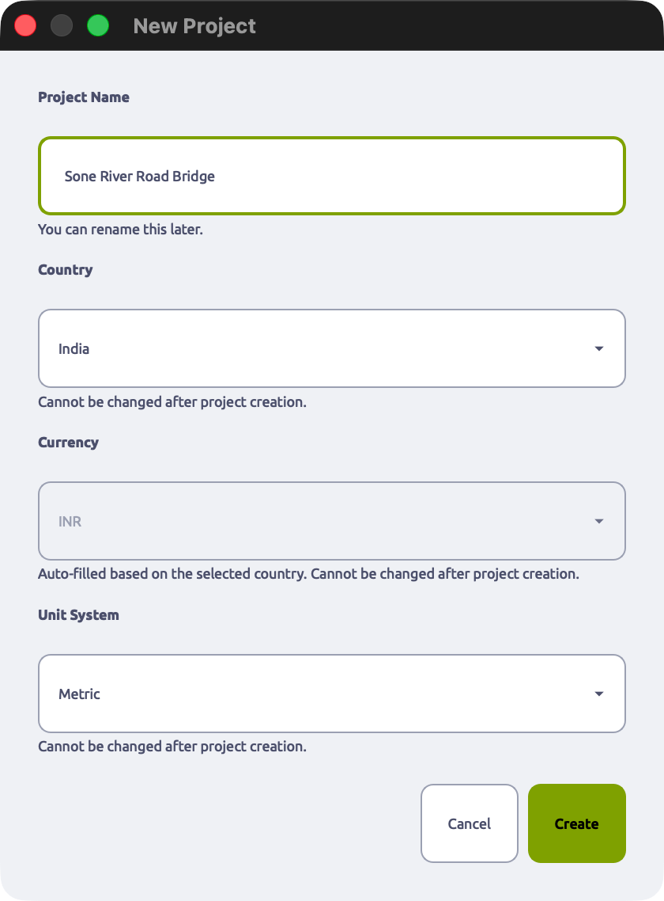

| Field | Required | Behaviour |
|-------|----------|-----------|
| **Project Name** | Yes | Free text. Can be edited later in the General Information section. |
| **Country** | Yes | Selects the material rate database and regional standards. **Locked after creation.** |
| **Currency** | Auto | Auto-filled when Country is selected. All monetary values across the project use this currency. **Locked after creation.** |
| **Unit System** | Yes | `Metric (SI)`: metres and kilograms. `Imperial (English)`: feet and pounds. **Locked after creation.** |

> Country, Currency, and Unit System cannot be changed after the project is created because every cost calculation, unit conversion, and material rate lookup in the project depends on them. Changing them mid-project would produce inconsistent results across all sections.

**Values used in this guide:**

```
Project Name : Sone River Road Bridge
Country      : India
Currency     : INR
Unit System  : Metric (SI)
```

Click **Create**. The app initialises the project and opens the project workspace.

---

### A.4 Opening an Existing Project

**From the Home Screen:** Click any project card. The project opens immediately.

**From disk:** Click **Open** in the sidebar. A file browser opens — navigate to the `.3psLCCA` file and select it.

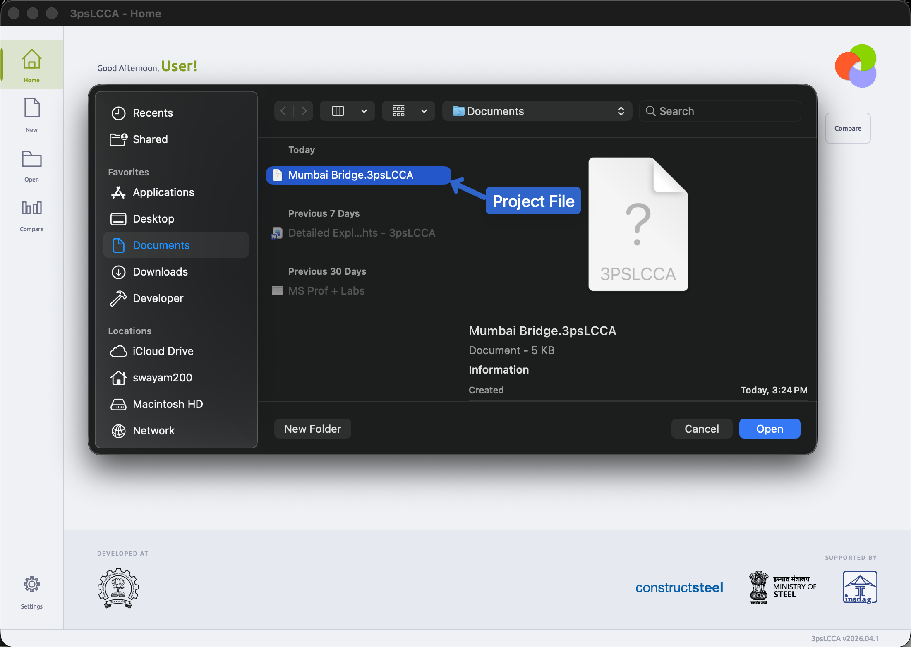

> A `.3psLCCA` file is a self-contained project archive. It holds all input data, results, and checkpoints for a single project. It can be copied, moved, or shared like any other file.

---

### A.5 Comparing Projects

The Compare view places two or more projects side by side, showing a breakdown of their life cycle costs. This is the primary tool for evaluating design alternatives against each other — for example, a concrete box girder bridge versus a cable-stayed bridge at the same location.

> Only projects that have been fully calculated (via the **Calculate** button) produce data in the comparison view.

#### A.5.1 Opening the Compare View

Click **Compare** in the sidebar.

<!-- ============================================================
IMAGE PLACEHOLDER — A.5.1
File: documentation_images/partA/08_compare_empty.png

HOW TO CAPTURE:
- Click Compare in the sidebar before any projects are loaded into comparison
- Full window screenshot

HOW TO ANNOTATE:
- ① Draw a rectangular blue box around the project selector / "Add Project" control
  Label: "① Select projects to compare"
- ② If an empty-state illustration or message is shown in the centre, draw a blue box
  Label: "② No projects loaded yet"
============================================================ -->


#### A.5.2 Loading Projects and Reading the Comparison Table

Add projects using the selector at the top of the Compare view. The table populates once at least two calculated projects are loaded.

<!-- ============================================================
IMAGE PLACEHOLDER — A.5.2
File: documentation_images/partA/09_compare_loaded.png

HOW TO CAPTURE:
- Load two or more calculated projects into the Compare view
- Full window screenshot showing the populated comparison table

HOW TO ANNOTATE:
- ① Draw a rectangular blue box along the top row containing project name headers
  Label: "① Project columns — one per project"
- ② Draw a rectangular blue box around one complete cost row
  (e.g. the "Initial Construction Cost" row)
  Label: "② Cost item row"
- ③ Draw a rectangular blue box around the grand total / LCCA total row at the bottom
  Label: "③ Total Life Cycle Cost (present value)"
- ④ If a bar chart or pie chart is visible, draw a rectangular blue box around it
  Label: "④ Visual cost breakdown"
- ⑤ Draw a rectangular blue box around the Add / Remove project controls
  Label: "⑤ Add or remove projects"
============================================================ -->


Each column in the table corresponds to one project. Each row is a cost category. The **Total Life Cycle Cost** row at the bottom is the single number used to compare alternatives.

---

### A.6 Settings

Click **Settings** in the sidebar. The Settings dialog opens as a modal window with two tabs: **General** and **Profiles**.

#### A.6.1 General Tab

The General tab controls display name and appearance.

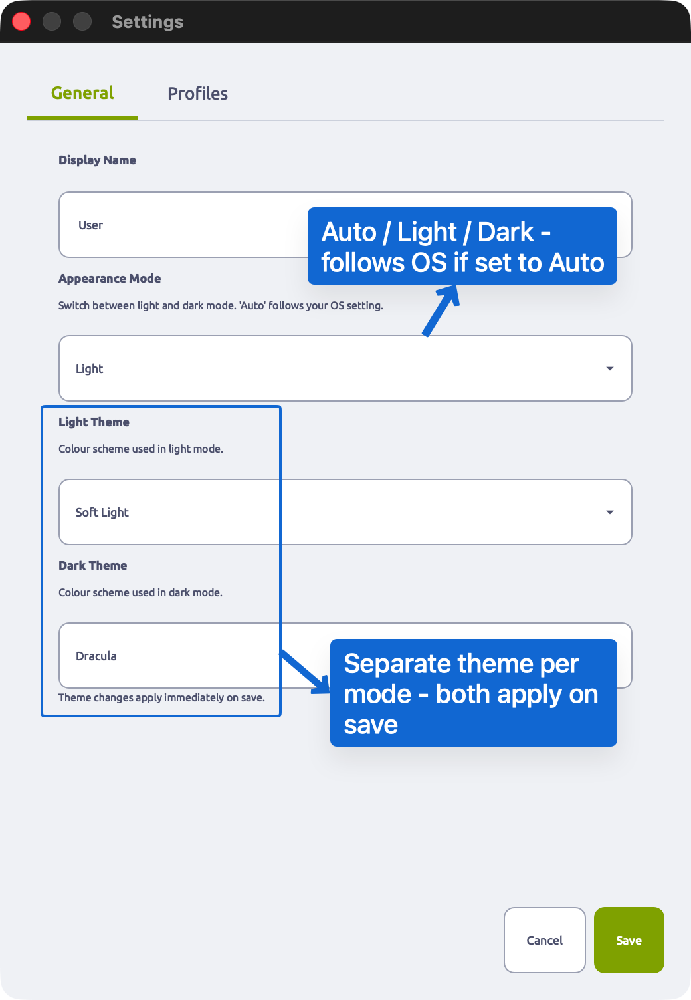

| Field | Description |
|-------|-------------|
| **Display Name** | Your name as it will appear in generated reports. |
| **Appearance Mode** | `Auto` follows the OS light/dark setting. `Light` and `Dark` override it. |
| **Light Theme** | Colour scheme used when in light mode. |
| **Dark Theme** | Colour scheme used when in dark mode. |

> Theme changes take effect immediately on clicking **Save**.

#### A.6.2 Profiles Tab

The Profiles tab stores agency details — name, logo, address, and contact information — that can be reused across projects.

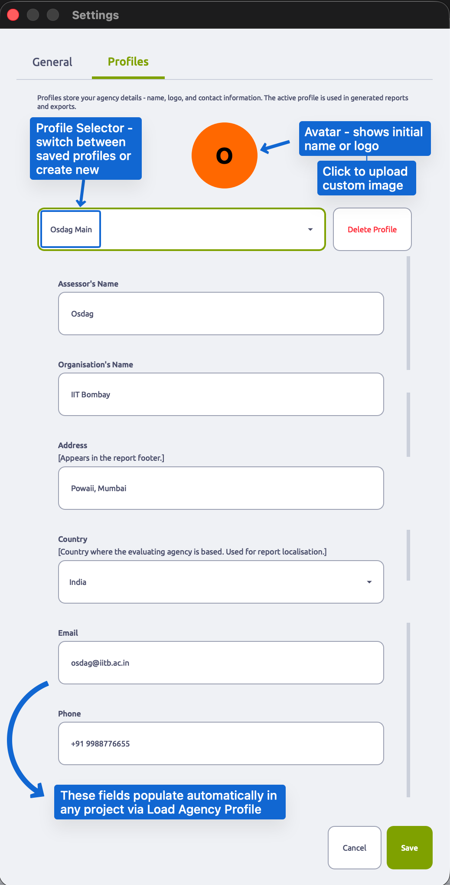

| Element | Description |
|---------|-------------|
| **Avatar** | Displays the first letter of the profile name, or the uploaded logo. Click to upload a PNG/JPG. |
| **Profile selector** | Dropdown listing all saved profiles. Select `+ New Profile` to create one. |
| **Delete Profile** | Permanently removes the selected profile from local storage. |
| **Form fields** | Assessor's name, organisation name, logo, address, country, email, phone. |

> Profiles are stored locally on the machine — not inside any project file. To populate a project's General Information section with a saved profile, use **Load Agency Profile** inside that project.

---

### A.7 Frequently Asked Questions

**Q: Can I rename a project after creation?**
Yes. The Project Name field in the **General Information** section is editable at any time. Country, Currency, and Unit System cannot be changed.

**Q: What happens if I open a project that is already open in another window?**
The app detects this and shows an `Open` status badge on the project card. Opening it again will prompt you to confirm.

**Q: The app shows "Needs Recovery" on my project. Is data lost?**
Not necessarily. This badge appears when the project was not closed cleanly (e.g. a crash or force-quit). Open the project — the app will attempt to recover the last saved state automatically. Check your data after recovery and use a Checkpoint if anything looks incorrect.

**Q: I cannot find my project on the Home Screen.**
Use the **Search bar** — type any part of the project name. Alternatively, use **Open** to browse directly to the `.3psLCCA` file on disk.

**Q: Can I share a project file with a colleague?**
Yes. Copy the `.3psLCCA` file and send it. Your colleague can open it using **Open** in their installation of 3psLCCA. All data, inputs, and results are embedded in the single file.

**Q: Compare shows zero values for one of my projects.**
The Compare tool only shows data for projects that have been calculated. Open the project, complete all required inputs, and click **Calculate** to generate results before comparing.

---


## Part B: Project Workspace and Basic Data Entry

After creating or opening a project, the project workspace opens. This is the main working environment where all project data is entered, edited, and calculated.

---

### B.1 The Project Workspace Layout

The workspace follows a consistent three-zone layout that persists across all data entry pages.

<!-- ============================================================
IMAGE PLACEHOLDER — B.1
File: documentation_images/partB/01_workspace_overview.png

HOW TO CAPTURE:
- Create the example project (Sone River Road Bridge) and open it
- Take a full window screenshot showing the project workspace
- General Information page should be active (it's the first page)

HOW TO ANNOTATE:
- ① Draw a rectangular blue box around the entire left sidebar
  Label: "① Navigation menu — access all data sections"
- ② Draw a rectangular blue box around the top header bar
  Label: "② Project header — name, status, action buttons"
- ③ Draw a rectangular blue box around the main content area
  Label: "③ Data entry area — forms, tables, and inputs"
- Use arrows pointing from labels outward to their respective zones
============================================================ -->


#### B.1.1 Left Navigation Menu

The left sidebar provides access to all project data sections.

<!-- ============================================================
IMAGE PLACEHOLDER — B.1.1
File: documentation_images/partB/02_left_navigation.png

HOW TO CAPTURE:
- Crop tightly to just the left sidebar navigation menu
- Height should include all menu items from top to bottom

HOW TO ANNOTATE:
- Draw rectangular blue boxes around each menu item, numbered ① to ⑩:
  ① "General Information"
  ② "Bridge Data"
  ③ "Construction Work Data"
  ④ "Financial Data"
  ⑤ "Traffic and Road Data"
  ⑥ "Maintenance Data"
  ⑦ "Demolition Data"
  ⑧ "Carbon Emission"
  ⑨ "Recycling"
  ⑩ "Results"
- For items ③ and ⑧, add a small note: "Has sub-menus"
============================================================ -->


| Menu Item | Purpose | Sub-pages |
|-----------|---------|-----------|
| **General Information** | Project metadata, agency details, basic settings | — |
| **Bridge Data** | Technical specifications, location, life cycle | — |
| **Construction Work Data** | Material quantities and costs for structural components | Foundation, Sub Structure, Super Structure, Misc |
| **Financial Data** | Economic parameters (discount rate, inflation, interest) | — |
| **Traffic and Road Data** | Traffic volume, accident rates, road parameters | — |
| **Maintenance Data** | Routine, periodic, and major maintenance schedules | — |
| **Demolition Data** | End-of-life costs and duration | — |
| **Carbon Emission** | Carbon footprint calculations | Material, Transportation, Machinery, Traffic Diversion, Social Cost |
| **Recycling** | Material recyclability and recovered value | — |
| **Results** | LCCA calculation results and comparison charts | — |

> The active page is highlighted in the menu. All menu items remain clickable at all times.

#### B.1.2 Project Header Bar

The top bar shows project identification and primary action buttons.

<!-- ============================================================
IMAGE PLACEHOLDER — B.1.2
File: documentation_images/partB/03_project_header.png

HOW TO CAPTURE:
- Crop to just the header bar area (top of window, full width)
- Include project name, status indicator, and buttons

HOW TO ANNOTATE:
- ① Blue arrow pointing to the project name text
  Label: "① Project name"
- ② Blue arrow pointing to the status indicator (dot or icon)
  Label: "② Status — unsaved changes / saved / calculated"
- ③ Draw a rectangular blue box around the "Save" button
  Label: "③ Save checkpoint"
- ④ Draw a rectangular blue box around the "Calculate" button
  Label: "④ Run LCCA analysis"
- ⑤ If visible, draw a rectangular blue box around the "Report" button
  Label: "⑤ Generate PDF report"
============================================================ -->


| Element | Description |
|---------|-------------|
| **Project name** | Display name of the current project. Click to edit. |
| **Status indicator** | Visual indicator of project state: white dot (unsaved), green check (saved), lock icon (calculated and locked). |
| **Save** | Creates a checkpoint. Saves all current data to the project file. |
| **Calculate** | Validates all inputs and runs the LCCA computation. Required before viewing Results or Compare. |
| **Report** | Generates a PDF report (available after calculation). |

---

### B.2 General Information

Click **General Information** in the left navigation menu. This page captures project metadata and agency details.

<!-- ============================================================
IMAGE PLACEHOLDER — B.2
File: documentation_images/partB/04_general_info_overview.png

HOW TO CAPTURE:
- Navigate to General Information page
- Full window screenshot
- If agency profile fields are empty, fill in example values first

HOW TO ANNOTATE:
- ① Draw a rectangular blue box around the "Project Information" section
  Label: "① Project Information"
- ② Draw a rectangular blue box around the "Evaluating Agency" section
  Label: "② Evaluating Agency"
- ③ Draw a rectangular blue box around the "Reviewed By" section
  Label: "③ Reviewed By"
- ④ Draw a rectangular blue box around the "Project Settings" section
  Label: "④ Project Settings — locked at creation"
- ⑤ Draw a rectangular blue box around the "Load Agency Profile" button
  Label: "⑤ Load saved profile"
============================================================ -->


#### B.2.1 Project Information

| Field | Editable | Description |
|-------|----------|-------------|
| **Project Name** | Yes | Display name used in reports and project listings. |
| **Project Code** | Yes | Internal reference code or contract number. |
| **Description** | Yes | Brief narrative description of the project. |
| **Remarks** | Yes | Additional notes, assumptions, or special conditions. |

#### B.2.2 Evaluating Agency

This section auto-populates when **Load Agency Profile** is clicked (if a profile was saved in Settings).

| Field | Description |
|-------|-------------|
| **Agency Logo** | PNG or JPG image. Appears on the cover page of generated reports. |
| **Agency Name** | Full legal name of the evaluating organisation. |
| **Contact Person** | Name of the primary assessor or engineer. |
| **Address** | Physical address of the agency. |
| **Country** | Country where the agency is based. |
| **Email** | Contact email address. |
| **Phone** | Contact phone number. |

#### B.2.3 Reviewed By

| Field | Description |
|-------|-------------|
| **Name** | Reviewer or approver name. |
| **Organization** | Reviewer's organisation. |
| **Address** | Reviewer's address. |
| **Country** | Reviewer's country. |
| **Email** | Reviewer's email. |
| **Phone** | Reviewer's phone. |

#### B.2.4 Project Settings

These fields are set at project creation and **cannot be changed**.

| Field | Description |
|-------|-------------|
| **Project Country** | Determines the material rate database and regional standards. |
| **Project Currency** | All monetary values use this currency. |
| **Unit System** | `Metric (SI)` or `Imperial (English)`. Affects all length and weight inputs. |
| **Material Suggestions** | Toggle auto-suggestions from the built-in material database. |

---

### B.3 Bridge Data

Click **Bridge Data** in the left navigation menu. This page captures the technical specifications and physical characteristics of the bridge.

<!-- ============================================================
IMAGE PLACEHOLDER — B.3
File: documentation_images/partB/05_bridge_data_overview.png

HOW TO CAPTURE:
- Navigate to Bridge Data page
- Fill in example values for the Sone River Road Bridge:
    Name of the Bridge: Sone River Road Bridge
    Owner: [Example State PWD or similar]
    Type of Bridge: Girder
    Span: 45 (metres)
    Carriageway Width: 7.5 (metres)
    Number of Lanes: 2
    Vehicle Path Direction: Two Way
    Footpath: No footpath (or Footpath at one side)
    Design Life: 50 (years)
    Year of Construction: 2024 (or current year)
    Duration of Construction: 18 (months)
- Full window screenshot

HOW TO ANNOTATE:
- ① Draw a rectangular blue box around the "Bridge Identification" section
  Label: "① Bridge Identification"
- ② Draw a rectangular blue box around the "Location" section
  Label: "② Location"
- ③ Draw a rectangular blue box around the "Technical Specifications" section
  Label: "③ Technical Specifications"
- ④ Draw a rectangular blue box around the "Life Cycle" section
  Label: "④ Life Cycle"
- ⑤ Draw a rectangular blue box around the "Construction Schedule" section
  Label: "⑤ Construction Schedule"
- ⑥ Draw a rectangular amber box around the "Clear All" button
  Label: "⑥ Clear All — resets all fields"
============================================================ -->


#### B.3.1 Bridge Identification

| Field | Description |
|-------|-------------|
| **Name of the Bridge** | Official name of the bridge structure. |
| **Owner** | Name of the owner, client, or responsible agency. |

#### B.3.2 Location

| Field | Description |
|-------|-------------|
| **Country** | Auto-filled from project creation. Locked. |
| **Bridge Alignment & Location** | Description of start point, end point, crossed feature (river, valley, railway), and nearby landmarks. |

#### B.3.3 Technical Specifications

| Field | Description | Typical Range |
|-------|-------------|---------------|
| **Type of Bridge** | Structural classification. Options: Girder, Arch, Cable-Stayed, Suspension, Truss, Box Girder, Slab, Other. | — |
| **Span** | Total span length between supports. | 20–500 m (girder bridges typically 30–100 m) |
| **Carriageway Width** | Clear width of the roadway portion. | 3.5–15 m |
| **Number of Lanes** | Total traffic lanes. | 1–8 |
| **Vehicle Path Direction** | One Way or Two Way traffic flow. | — |
| **Footpath** | Pedestrian provision: No footpath / Footpath at one side / Footpath at both sides. | — |

> **Validation warnings:** The app highlights unusual values. Span > 5000 m, carriageway width < 1.5 m or > 50 m, or lanes > 16 trigger verification prompts.

#### B.3.4 Life Cycle

| Field | Description | Typical Value |
|-------|-------------|---------------|
| **Design Life** | Expected operational service life in years. | 50–100 years |
| **Year of Construction** | Year of construction (past or future). | Current year or future |

> **Validation:** Year of Construction before the current year triggers a warning to verify the input is intentional.

#### B.3.5 Construction Schedule

| Field | Description | Typical Value |
|-------|-------------|---------------|
| **Duration of Construction** | Total construction time in months. | 6–48 months |
| **Working Days per Month** | Assumed working days for scheduling. Default: 22 | 20–26 days |
| **Days per Month** | Days per month the road traffic is affected. Default: 30 | 29–31 days |

> **Cross-field validation:** Working Days per Month cannot exceed Days per Month. If violated, a warning appears on the Working Days field.

---

## Part C — Construction Work Data

The Construction Work Data page captures the **bill-of-quantities style material inputs** used to compute the **initial construction cost** of the bridge. Data is organised into four tabs aligned to typical bridge construction categories: **Foundation**, **Sub-Structure**, **Super-Structure**, and **Miscellaneous**.

Each tab contains **component sections** (e.g., *Pile Cap*, *Pier*, *Girder*) with a material table under each component. Materials can be entered manually or imported from an Excel template. Items moved to Trash are excluded from calculations until restored.

---

### C.1 Overview of the Construction Work Data page

Open **Construction Work Data** from the left navigation menu. The page contains:

- A top header area labelled **Construction Works Data**
- Action buttons: **Import Excel**, **Export Excel**, and **Trash** (shows a count when items exist in Trash)
- A tab bar for **Foundation**, **Sub-Structure**, **Super-Structure**, and **Miscellaneous**

<!-- ============================================================
IMAGE PLACEHOLDER — C.1
File: documentation_images/partC/01_construction_work_data_overview.png

HOW TO CAPTURE:
- Open the example project: "Sone River Road Bridge"
- Navigate to Construction Work Data
- Ensure at least 1 material exists in any tab so the summary bar shows real totals
- Full window screenshot (include window titlebar)

HOW TO ANNOTATE:
- ① Draw a rectangular blue box around the Import Excel and Export Excel buttons
  Label: "① Excel import/export — bulk entry and template-based updates"
- ② Draw a rectangular blue box around the Trash button
  Label: "② Trash — excluded items (count shown when non-empty)"
- ③ Draw a rectangular blue box around the tab bar (Foundation/Sub-Structure/Super-Structure/Miscellaneous)
  Label: "③ Tabs — structural categories"
- ④ Draw a rectangular blue box around the per-tab summary bar (Total + Items)
  Label: "④ Summary — tab total cost and item count"
============================================================ -->


#### C.1.1 Tab summary bar

Each tab shows a summary bar at the top with:

- **Total (Currency)** — sum of \(Quantity \times Rate\) for all active (non-trashed) materials in the current tab
- **Items** — number of active (non-trashed) material rows in the current tab

> Items in Trash are excluded from both Total and Items.

---

### C.2 Foundation tab

Open the **Foundation** tab. A component section is displayed for each foundation component. By default, a new project includes these Foundation components:

- **Excavation**
- **Pile**
- **Pile Cap**

Each component section contains:

- A materials table
- A button **Add Material to \<Component\>**
- A button **Delete Component**

<!-- ============================================================
IMAGE PLACEHOLDER — C.2
File: documentation_images/partC/02_foundation_tab_layout.png

HOW TO CAPTURE:
- In Construction Work Data, open the Foundation tab
- Ensure all default components are visible (Excavation, Pile, Pile Cap)
- Add at least one material row in any one component so the table is populated
- Full window screenshot

HOW TO ANNOTATE:
- ① Draw a rectangular blue box around one entire component block (component title + table + buttons)
  Label: "① Component section — materials grouped by structural component"
- ② Draw a rectangular blue box around the "Add Material to ..." button in that component
  Label: "② Add Material — opens the material entry dialog"
- ③ Draw a rectangular blue box around the Action column region on the right side of the table
  Label: "③ Row actions — Edit and Move to trash"
============================================================ -->


#### C.2.1 Materials table (per component)

Each component table uses the same columns:

| Column | Meaning |
|--------|---------|
| **Work Name** | Material name as entered in the Material dialog |
| **Quantity** | Quantity value entered in the Material dialog |
| **Unit** | Unit selected in the Material dialog |
| **Rate/Unit (Currency)** | Unit rate entered or auto-filled |
| **Source** | Rate source text (manual or database reference text) |
| **Total (Currency)** | \(Quantity \times Rate\) |
| **Action** | Edit material, Move to trash |

> Double-clicking a material row opens the Edit dialog for that row.

#### C.2.2 Adding a component (Foundation)

Click **+ Add Component** at the bottom of the tab. Enter a component name and click **Add**.

> If the component name already exists in the same tab, a duplicate warning is shown and the component is not created.

#### C.2.3 Deleting a component (Foundation)

Click **Delete Component** inside a component section. Confirmation is required.

> Deleting a component permanently removes the component and all its materials (including any items not in Trash).

---

### C.3 Sub-Structure tab

Open the **Sub-Structure** tab. By default, a new project includes these Sub-Structure components:

- **Pier**
- **Pier Cap**
- **Pedestal**
- **Bearings**

The Sub-Structure tab uses the same component-section layout, materials table columns, and row actions described in C.2.

<!-- ============================================================
IMAGE PLACEHOLDER — C.3
File: documentation_images/partC/03_sub_structure_tab.png

HOW TO CAPTURE:
- Open the Sub-Structure tab
- Ensure at least one component has 1+ material row so row actions are visible
- Full window screenshot

HOW TO ANNOTATE:
- ① Draw a rectangular blue box around the "+ Add Component" button at the bottom
  Label: "① Add Component — creates a new component section in this tab"
============================================================ -->


---

### C.4 Super-Structure tab

Open the **Super-Structure** tab. By default, a new project includes these Super-Structure components:

- **Girder**
- **Deck Slab**
- **Diaphragm**
- **Cross Bracings**

The Super-Structure tab uses the same component-section layout, materials table columns, and row actions described in C.2.

<!-- ============================================================
IMAGE PLACEHOLDER — C.4
File: documentation_images/partC/04_super_structure_tab.png

HOW TO CAPTURE:
- Open the Super-Structure tab
- Ensure at least one component contains material rows
- Keep Girder and Deck Slab sections visible
- Full window screenshot

HOW TO ANNOTATE:
- ① Draw a rectangular blue box around one full super-structure component section
  Label: "① Super-structure components — deck and load-carrying bridge elements"
============================================================ -->
---

### C.5 Miscellaneous tab

Open the **Miscellaneous** tab. By default, a new project includes these Miscellaneous components:

- **Railing  & Crash Barrier & Median**
- **Drainage**
- **Asphalt, Utilities and Other Materials**
- **Waterproofing**

The Miscellaneous tab uses the same component-section layout, materials table columns, and row actions described in C.2.

> During Excel import, any unrecognised CAT# sheet name is routed into Miscellaneous and grouped under a component name derived from the sheet name.
<!-- ============================================================
IMAGE PLACEHOLDER — C.5
File: documentation_images/partC/05_miscellaneous_tab.png

HOW TO CAPTURE:
- Open the Miscellaneous tab
- Ensure at least one component contains material rows
- Keep Asphalt, Utilities and Other Materials visible
- Full window screenshot

HOW TO ANNOTATE:
- ① Draw a rectangular blue box around one miscellaneous component section
  Label: "① Miscellaneous works — auxiliary bridge elements and finishing items"
============================================================ -->
---

### C.6 Adding a material (Material Dialog)

Click **Add Material to \<Component\>** in any component section. The **Add Material** dialog opens. The same dialog is used for:

- **Add Material** — adding a new row
- **Edit Material** — editing an existing row (opened via Edit action or double-click)

<!-- ============================================================
IMAGE PLACEHOLDER — C.6
File: documentation_images/partC/04_material_dialog_overview.png

HOW TO CAPTURE:
- Open any tab (e.g., Foundation → Pile Cap)
- Click "Add Material to Pile Cap"
- Ensure the dialog is fully visible (scroll to show Carbon Emission Factor and Recyclability sections)
- Screenshot the dialog only (crop to dialog bounds)

HOW TO ANNOTATE:
- ① Draw a rectangular blue box around the "Allow editing DB-filled values" checkbox
  Label: "① DB lock — prevents accidental edits to suggested values"
- ② Draw a rectangular blue box around the Carbon Emission Factor "Include" checkbox
  Label: "② Carbon inclusion toggle — controls whether carbon fields are used"
- ③ Draw a rectangular blue box around the Recyclability "Include" checkbox
  Label: "③ Recyclability inclusion toggle — controls whether recycling fields are used"
============================================================ -->


#### C.6.1 Material suggestions and auto-fill (when configured)

The dialog can provide material suggestions from the project’s configured schedule-of-rates (SOR) database.

- A label **Suggestions from:** shows the active database key.
- If a database is configured, a **Category** dropdown may appear for filtering suggestions.
- In **Material Name**, entering `?` opens the full suggestion list.
- Selecting a suggested material auto-fills fields such as Unit, Item ID / SOR Code, Rate, Rate Source, and Carbon Emission Factor (when available).

> When a suggestion is selected, DB-filled fields are locked by default. Use **Allow editing DB-filled values** only when changes are intentional.

#### C.6.2 Basic fields

| Field | Required | Description |
|-------|----------|-------------|
| **Material Name** | Yes | Work name shown in the table. Also used to detect duplicates inside the same component. |
| **Item ID / SOR Code** | No | Optional reference code for traceability. |
| **Quantity** | Yes | Must be greater than zero. |
| **Unit** | Yes | Unit code/symbol for the quantity. |
| **Rate (Unit Cost)** | No | Unit rate. When suggestions are used, this may be auto-filled. |
| **Rate Source** | No | Text reference for the rate (e.g., DSR year, market source). |

> **Validation:** Material Name is required. Quantity must be \(> 0\). Duplicate names inside the same component are blocked when adding a new row.

#### C.6.3 Carbon Emission Factor

This section controls per-material carbon emission fields.

| Field / Control | Purpose |
|----------------|---------|
| **Include** | If enabled, carbon emission data is stored and used for carbon calculations. |
| **Emission Factor** | Numeric emission factor. |
| **Per Unit (kgCO₂e / …)** | Denominator unit used with the emission factor. |
| **Source** | Reference for emission factor. |
| **Conversion Factor** | Factor converting the material unit into the denominator unit when needed. |

The dialog also shows a **formula preview** when Quantity, Emission Factor, and Conversion Factor are valid non-zero values.

> **Validation warnings (carbon):**
> - If Include is enabled but Emission Factor is 0, a warning is shown and carbon inclusion may be disabled.
> - If Include is enabled but Conversion Factor is 0, a warning is shown and carbon inclusion may be disabled.
> - If material unit and carbon denominator unit represent different dimensions and Conversion Factor is 1.0, a confirmation warning is shown.

#### C.6.4 Recyclability

This section controls end-of-life scrap and recovery fields.

| Field / Control | Purpose |
|----------------|---------|
| **Include** | If enabled, recycling/scrap data is stored and used for recyclability calculations. |
| **Scrap Rate (unit cost)** | Scrap value per unit at end-of-life. |
| **Recovery after Demolition (%)** | Percentage recovery after demolition (0–100). |

> **Validation (recyclability):**
> - Recovery percentage cannot exceed 100%.
> - If Include is enabled but both Scrap Rate and Recovery are zero, a warning is shown and recyclability inclusion may be disabled.

#### C.6.5 Dialog actions

| Button | Behaviour |
|--------|----------|
| **Save to Custom DB…** | Saves the current material definition into a user-created custom database for future suggestions. |
| **Cancel** | Closes the dialog without saving changes. |
| **Add to Table** | Adds the material as a new row in the component table. |
| **Update Changes** | Saves edits to the selected material row. |

---

### C.7 Uploading from Excel (Import Excel)

Click **Import Excel**. Select a supported file type:

- Excel: `.xlsx`, `.xls`
- OpenDocument Spreadsheet: `.ods`

After selection, the app parses the file and opens an **Import Preview** window for review and correction before writing into the project.

#### C.7.1 Required sheet naming

Only sheets whose names begin with `CAT#` are treated as material sheets.

- Example recognised sheet names:
  - `CAT#Foundation`
  - `CAT#Sub-Structure`
  - `CAT#Super-Structure`
  - `CAT#Misc`
- A sheet named `Metadata` (case-insensitive) is parsed separately and shown as a read-only Metadata tab in the preview.

> Sheets that do not start with `CAT#` are ignored during import (except `Metadata`).

#### C.7.2 Required column header format (CID# prefix)

Within each `CAT#...` sheet, columns must use the `CID#` prefix (case-insensitive). The part after `CID#` must match a recognised canonical field name.

**Recognised CID# column names:**

- `CID#ID`
- `CID#Name`
- `CID#Quantity`
- `CID#Unit`
- `CID#Rate`
- `CID#Rate_Src`
- `CID#Carbon_Emission_Factor`
- `CID#Carbon_Emission_units`
- `CID#Conversion_Factor`
- `CID#Carbon_Emission_Src`
- `CID#Scrap_Rate`
- `CID#Recovery_Pct`
- `CID#Component`

> CID# header matching is case-insensitive for the prefix, but the canonical field name must match a recognised name. Unrecognised `CID#...` columns are ignored and shown as warnings in the preview.

#### C.7.3 Import Preview window behaviour

The preview window shows one tab per imported sheet.

- Cells are editable by double-click.
- An **Issues** column summarises row-level problems.
- Error rows are highlighted red and cannot be selected for import.
- Warning rows are highlighted yellow and can be imported.
- A **Valid rows only** filter hides rows where Name, Quantity, Rate, or Unit are missing/zero.

> If a row’s Name already exists in the target component in the project (matched case-insensitively), the row is flagged as a duplicate and is **unchecked by default**. Selecting it forces an overwrite-style import for that row.

#### C.7.4 Component routing during import

The import uses `CID#Component` to determine which component section the row belongs to.

- If `CID#Component` is blank, it is assigned to **Uncategorised**.
- If the sheet name after `CAT#` does not match a known category, the sheet is routed to **Miscellaneous**, and its name is prefixed into the component name during import.

> If incoming component names already exist in the project, the import prompts for how to handle each conflict: **Merge** (append into existing component) or **Rename** (import as a new component with an auto-suffix such as “(Imported)”).

---

### C.8 Trash

Materials can be moved out of active calculation without deleting them by using Trash.

#### C.8.1 Moving a material to Trash

In any component table, click the Trash action for a row.

Effect:

- The row is removed from the active component table
- The tab’s **Total** and **Items** values update immediately
- The Trash button shows a count badge (e.g., `🗑️ (3)`)

#### C.8.2 Opening Trash view

Click the Trash button.

The view switches from the four-tab workspace to the **Trash Bin** view.

- The Trash button label becomes **Back to Work**
- Trashed items are grouped under headings of the form **Deleted from: \<Component\>**
- Trashed items are explicitly excluded from all calculations

<!-- ============================================================
IMAGE PLACEHOLDER — C.8
File: documentation_images/partC/05_trash_view.png

HOW TO CAPTURE:
- Ensure at least 2 materials exist in Trash across different components
- Click the Trash button to open Trash Bin
- Full window screenshot

HOW TO ANNOTATE:
- ① Draw a rectangular blue box around the "Back to Work" button state
  Label: "① Back to Work — returns to the tabbed entry view"
- ② Draw a rectangular blue box around one "Deleted from: ..." group box
  Label: "② Trashed items grouped by original component"
- ③ Draw a rectangular blue box around the Action column in a trash table
  Label: "③ Trash actions — Restore or Permanently delete"
============================================================ -->


#### C.8.3 Restoring a material

In Trash Bin, click **Restore** on a row.

Effect:

- The item is removed from Trash
- The item is reinserted into its original component table
- The Trash count updates

#### C.8.4 Permanently deleting a material

In Trash Bin, click **Permanently delete** on a row. Confirmation is required.

> Permanent delete cannot be undone.

---

### C.9 Example values — Sone River Road Bridge (45 m RCC T-Girder)

Use the following example entries to populate Construction Work Data for the Sone River Road Bridge. These are representative quantities for a straightforward RCC T-Girder bridge and are intended for demonstrating workflow and reporting.

> These entries are examples for the guide. Use project-specific BOQ values for real analyses.

#### C.9.1 Foundation tab — example materials

**Component: Excavation**

| Material Name | Quantity | Unit | Rate (INR) | Rate Source |
|--------------|----------|------|------------|-------------|
| Excavation in soil (ordinary) | 220 | m3 | 450 | DSR 2023 |
| Dewatering and disposal | 1 | ls | 250000 | Project estimate |

**Component: Pile**

| Material Name | Quantity | Unit | Rate (INR) | Rate Source |
|--------------|----------|------|------------|-------------|
| Bored cast-in-situ RCC pile concrete (M30) | 120 | m3 | 6500 | Market rate (Bihar) |
| Reinforcement steel (Fe500) | 14 | tonne | 72000 | Market rate (steel) |
| Pile cage fabrication and placing | 1 | ls | 180000 | Contractor quote |

**Component: Pile Cap**

| Material Name | Quantity | Unit | Rate (INR) | Rate Source |
|--------------|----------|------|------------|-------------|
| RCC in pile cap (M30) | 95 | m3 | 6500 | Market rate (Bihar) |
| Reinforcement steel (Fe500) | 11 | tonne | 72000 | Market rate (steel) |
| Formwork for pile cap | 650 | m2 | 950 | DSR 2023 |

#### C.9.2 Sub-Structure tab — example materials

**Component: Pier**

| Material Name | Quantity | Unit | Rate (INR) | Rate Source |
|--------------|----------|------|------------|-------------|
| RCC in pier shaft (M35) | 80 | m3 | 7000 | Market rate (Bihar) |
| Reinforcement steel (Fe500) | 12 | tonne | 72000 | Market rate (steel) |
| Formwork for pier shaft | 900 | m2 | 1050 | DSR 2023 |

**Component: Pier Cap**

| Material Name | Quantity | Unit | Rate (INR) | Rate Source |
|--------------|----------|------|------------|-------------|
| RCC in pier cap (M35) | 55 | m3 | 7000 | Market rate (Bihar) |
| Reinforcement steel (Fe500) | 8 | tonne | 72000 | Market rate (steel) |
| Formwork for pier cap | 520 | m2 | 1050 | DSR 2023 |

**Component: Pedestal**

| Material Name | Quantity | Unit | Rate (INR) | Rate Source |
|--------------|----------|------|------------|-------------|
| RCC in pedestal (M35) | 12 | m3 | 7000 | Market rate (Bihar) |
| Reinforcement steel (Fe500) | 1.5 | tonne | 72000 | Market rate (steel) |

**Component: Bearings**

| Material Name | Quantity | Unit | Rate (INR) | Rate Source |
|--------------|----------|------|------------|-------------|
| Elastomeric bearings (neoprene) | 16 | nos | 18000 | Vendor quote |

#### C.9.3 Super-Structure tab — example materials

**Component: Girder**

| Material Name | Quantity | Unit | Rate (INR) | Rate Source |
|--------------|----------|------|------------|-------------|
| Precast RCC T-girders (M40) | 160 | m3 | 8200 | Market rate (precast yard) |
| Reinforcement steel (Fe500) | 20 | tonne | 72000 | Market rate (steel) |
| Erection of girders (crane + labour) | 1 | ls | 350000 | Contractor quote |

**Component: Deck Slab**

| Material Name | Quantity | Unit | Rate (INR) | Rate Source |
|--------------|----------|------|------------|-------------|
| RCC in deck slab (M35) | 95 | m3 | 7000 | Market rate (Bihar) |
| Reinforcement steel (Fe500) | 16 | tonne | 72000 | Market rate (steel) |
| Formwork for deck slab | 1200 | m2 | 950 | DSR 2023 |

**Component: Diaphragm**

| Material Name | Quantity | Unit | Rate (INR) | Rate Source |
|--------------|----------|------|------------|-------------|
| RCC diaphragms (M35) | 18 | m3 | 7000 | Market rate (Bihar) |
| Reinforcement steel (Fe500) | 3 | tonne | 72000 | Market rate (steel) |

**Component: Cross Bracings**

| Material Name | Quantity | Unit | Rate (INR) | Rate Source |
|--------------|----------|------|------------|-------------|
| RCC cross bracings (M35) | 10 | m3 | 7000 | Market rate (Bihar) |
| Reinforcement steel (Fe500) | 2 | tonne | 72000 | Market rate (steel) |

#### C.9.4 Miscellaneous tab — example materials

**Component: Railing  & Crash Barrier & Median**

| Material Name | Quantity | Unit | Rate (INR) | Rate Source |
|--------------|----------|------|------------|-------------|
| RCC railing/parapet (M30) | 35 | m3 | 6500 | Market rate (Bihar) |
| Crash barrier (steel) | 180 | m | 3200 | Vendor quote |

**Component: Drainage**

| Material Name | Quantity | Unit | Rate (INR) | Rate Source |
|--------------|----------|------|------------|-------------|
| Drain spouts / weep holes | 40 | nos | 450 | DSR 2023 |
| Drainage pipe and fittings | 1 | ls | 45000 | Project estimate |

**Component: Asphalt, Utilities and Other Materials**

| Material Name | Quantity | Unit | Rate (INR) | Rate Source |
|--------------|----------|------|------------|-------------|
| Bituminous wearing course | 340 | m2 | 650 | DSR 2023 |
| Approach slab / utility shifting | 1 | ls | 200000 | Project estimate |

**Component: Waterproofing**

| Material Name | Quantity | Unit | Rate (INR) | Rate Source |
|--------------|----------|------|------------|-------------|
| Waterproofing membrane | 340 | m2 | 420 | DSR 2023 |

---

### Part C — Screenshot checklist

| Checklist Item | File |
|----------------|------|
| Construction Work Data — Overview (annotated) | `documentation_images/partC/01_construction_work_data_overview.png` |
| Foundation Tab — Layout (annotated) | `documentation_images/partC/02_foundation_tab_layout.png` |
| Sub-Structure Tab (annotated) | `documentation_images/partC/03_sub_structure_tab.png` |
| Material Dialog — Overview (annotated) | `documentation_images/partC/04_material_dialog_overview.png` |
| Trash View (annotated) | `documentation_images/partC/05_trash_view.png` |

